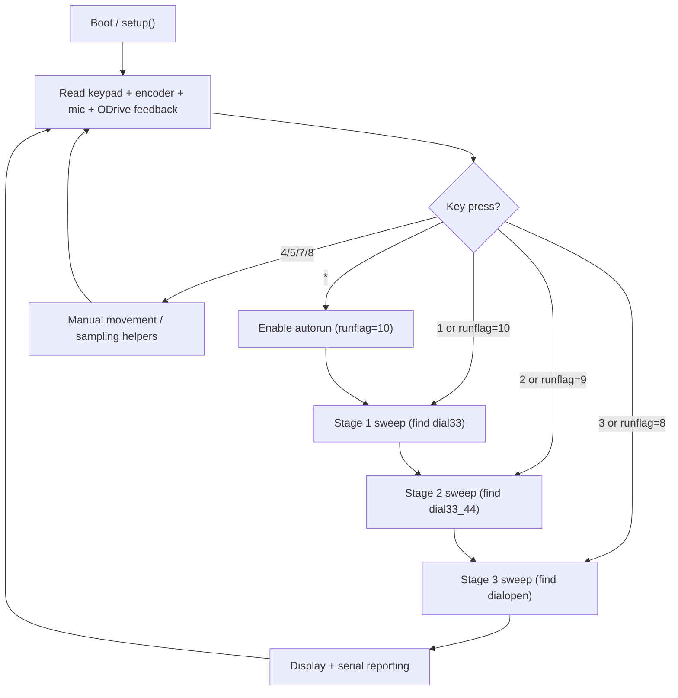

# Fast Safe Decoder

Archive and documentation for a Teensy 4.0 + ODrive dial automation sketch.

This repo preserves the handwritten original code and documents how the system works.
On this branch, it also includes a suggested next-version starter for cleanup/refactor work.

## Versions In This Branch

- `SafeTherapy_v0.33.ino`: Archived handwritten version (kept as-is).
- `SafeTherapy_v0.34_suggested.ino`: Suggested modernization starter.

## Hardware + Interfaces

- MCU: Teensy 4.0
- Motor controller: ODrive over `Serial1` at 115200
- Dial feedback: Rotary encoder on pins `2` and `3` with interrupt capture
- Contact sensing: Analog microphone on `A0`
- UI: SparkFun Qwiic Keypad + OpenLCD (`0x72`) over I2C

## Library Dependencies

Install from Arduino Library Manager:

- `SparkFun_Qwiic_Keypad_Arduino_Library`
- `EncoderStepCounter`

Core include:

- `Wire.h`

## How The Original Sketch Works

The original flow is a keypad-driven 3-stage search:

1. Stage 1 (`button '1'` or auto-run): sweeps candidate third-number positions and tracks strongest contact-point signature.
2. Stage 2 (`button '2'` or auto-run): with stage-1 result fixed, sweeps candidate second-number positions and tracks best signature.
3. Stage 3 (`button '3'` or auto-run): with first two numbers fixed, sweeps candidate first-number values and checks opening behavior using timeout-based detection.

Auto-run sequence:

- Press `*` to set `runflag = 10`, then the sketch chains stage 1 -> stage 2 -> stage 3.

Manual helpers:

- `7`: nudge setpoint positive (`+4000` counts)
- `8`: nudge setpoint negative (`-4000` counts)
- `4` and `5`: direct spin/contact-point sampling routines

## Control Flow Diagram

## Signal / Motion Model

- ODrive position commands are sent as `p 0 <setpoint>`.
- ODrive feedback query uses `f 0`, then parses response tokens from serial.
- Dial conversion constants in original sketch:
  - `81.92` counts per dial increment
  - `20.48*2` used for encoder scaling back to dial units
- Microphone peaks (typically thresholded around `700`) are used as contact indicators in specific dial windows.

## Variable Guide (Original v0.33)

These are the main globals in `SafeTherapy_v0.33.ino`, grouped by purpose.

### Serial + Input

- `input1`, `input2`: Parsed ODrive serial response fields
- `button`: Current keypad button value

### Dial / Position

- `dial0`: Raw-ish dial position in controller count domain
- `dial1`: Dial position normalized to dial units
- `dial2`: Derived encoder dial estimate
- `position`: Accumulated encoder count
- `dialsetpoint`: Active commanded target for ODrive
- `rawencoder`, `secondencoder`: legacy/auxiliary counters

### Candidate Combination Values

- `dial33`: Best stage-1 candidate (third number)
- `dial33_2`: derived setpoint helper for stage transitions
- `dial33_44`: Best stage-2 candidate (second number)
- `dial33_244`: stage-3 derived setpoint helper
- `dial44`, `dial55`: loop index helpers for stage 2/3
- `dialopen`: stage-3 result (opening candidate / first number)

### Contact / Microphone Tracking

- `mic`: Current microphone sample
- `mic1`, `mic2`: peak trackers in windows
- `mic1d`, `mic2d`: dial positions of peaks
- `mic1dd`: running best metric in stage 1
- `mic1_2`, `mic2_2`, `mic1d_2`, `mic2d_2`, `mic1dd_2`: stage-2 equivalents

### Timing + Control

- `loopstart`, `looptime`: stage timing
- `timestart`, `timeend`: additional timing placeholders
- `tts`, `tte`: total-run start/end timing
- `timeoutstart`: stage-3 timeout detector
- `runflag`: auto-sequencing state (10 -> 9 -> 8 -> 7)
- `endflag`: stage-3 completion flag
- `dialstep`: sweep increment (default `2`)

### Display / Search Bounds Helpers

- `dialhighpoint`, `dialhigh`, `dialhigha`, `diallow`, `diallowa`, `diallow5`, `bestdial`, `dialcompare`, `dialprevious`, `sync`, `sync2`
- Several of these are legacy helpers or debug-era remnants.

## Why A Suggested v0.34 File Exists

`SafeTherapy_v0.34_suggested.ino` is a cleanup starting point that:

- keeps hardware/library assumptions the same
- converts magic numbers to named constants
- groups logic into small functions
- adds safer serial parsing boundaries
- makes staged flow explicit for easier testing and tuning

It is intentionally non-destructive: the original handwritten file remains archived unchanged.

## Suggested Next Improvements

1. Split each stage into dedicated source files (if moving to PlatformIO/CMake).
2. Replace blocking `while` loops with timeout-guarded helpers everywhere.
3. Add structured serial logging (`CSV` with headers per stage).
4. Add calibration constants per hardware build (mic gain, thresholds, steps).
5. Add replay mode using recorded traces for faster tuning without hardware wear.

## Publish Notes

Repository URL:

- [https://github.com/dustin-gamble/fast-safe-decoder](https://github.com/dustin-gamble/fast-safe-decoder)

Recommended tags/branches:

- tag the archived handwritten baseline (example: `archive/v0.33-handwritten`)
- keep suggested cleanup work in a dedicated branch (`codex/suggested-updates`)
